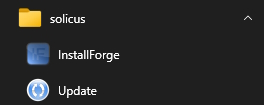
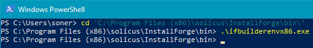

# Installation

The installation of InstallForge is performed via a simple setup wizard, which, in addition to extracting all the
required artifacts, carries out automatic configuration on your system. This makes the installation process quite
straightforward.

!!! danger "Important"

    Before installing InstallForge, make sure that your build system meets the specified prerequisites.

!!! info

    The installation of InstallForge requires elevation to administrator privileges.

In order to install InstallForge on your system follow these steps:

1. Download the setup package executable for the latest version of InstallForge from the
   [Download page](https://installforge.net/download).
1. Once downloaded, launch the setup package executable and follow the steps of the setup wizard.
   By default, InstallForge is installed under in `C:\Program Files (x86)\solicus\InstallForge\`

## Launch

After installation, InstallForge can be launched in different ways. The most convenient way is through the Windows
Start menu.

### Launch via the Windows Start Menu

To start InstallForge from the Windows Start menu, locate the folder named `solicus` and click on the `InstallForge`
shortcut, as depicted below.

<figure markdown>
  
  <figcaption>InstallForge Shortcut</figcaption>
</figure>

### Launch by Other Means

Another way to launch InstallForge is to use the _Windows File Explorer_. To do this, use the File Explorer to
navigate to the folder `bin` folder in the InstallForge installation directory[^1] and double-click on the
executable file `ifbuilderenvx86.exe`.

An additional possibility is to use the shell (_Windows Command Prompt_ or _PowerShell_). Below, the commands
are listed for _PowerShell_[^2]:

``` shell
$ cd 'C:\Program Files (x86)\solicus\InstallForge\bin\'
$ .\ifbuilderenvx86.exe
```

<figure markdown>
  
  <figcaption>Launch InstallForge via PowerShell</figcaption>
</figure>

[^1]: Typically `C:\Program Files (x86)\solicus\InstallForge\`.
[^2]: It is assumed here that the InstallForge installation directory is `C:\Program Files (x86)\solicus\InstallForge\`.

## Update

There exist two ways to update an existing installation of InstallForge. Either download the setup package of the 
current version from the [Download page](https://installforge.net/download) and follow the steps of the setup wizard 
(see also section [Installation](installation.md#installation) ) or launch the integrated online updater.

!!! tip

    The recommended way is to use the integrated online updater.

In order to update InstallForge to the latest version using the integrated online updater, follow these steps:

1. Launch InstallForge.
1. In the main menu, click `Help` → `Update...`.

The integrated online updater (_InstallForge Update_) will then be launched, connecting to the InstallForge update 
server and checking if there is a new version available. In case you are notified about a new available version, follow 
the steps of the update wizard.

## Uninstallation

In order to uninstall InstallForge, use the uninstaller by following these steps:

1. In the _Windows Start Menu_, locate the folder `solicus` and click the shortcut `Uninstall`. This will launch the 
   uninstall wizard.
2. Follow the steps of the uninstall wizard.
