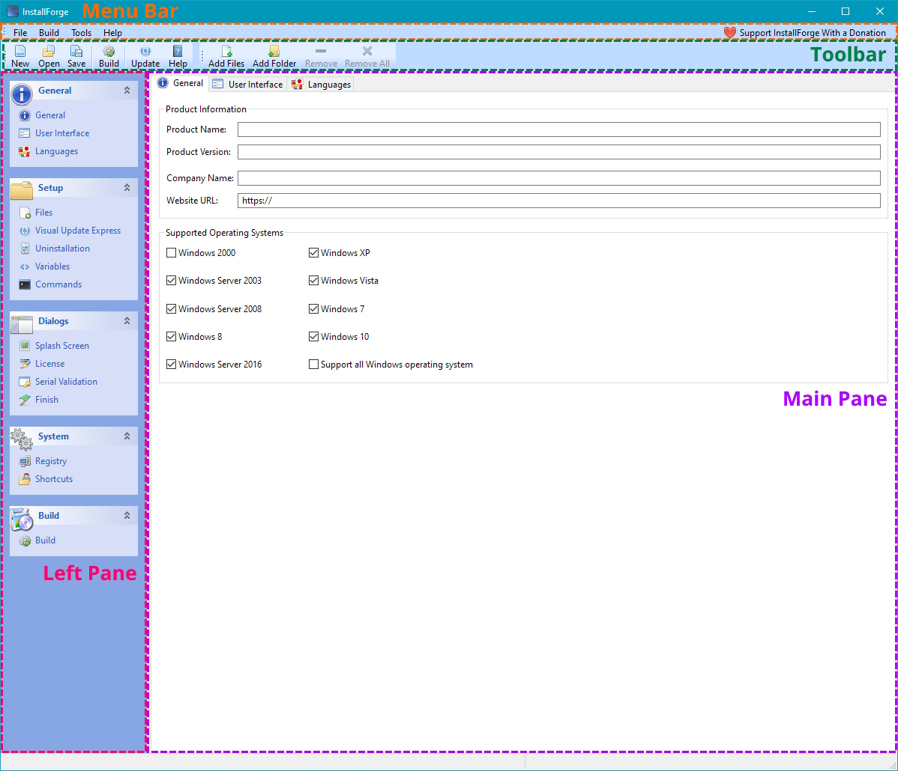
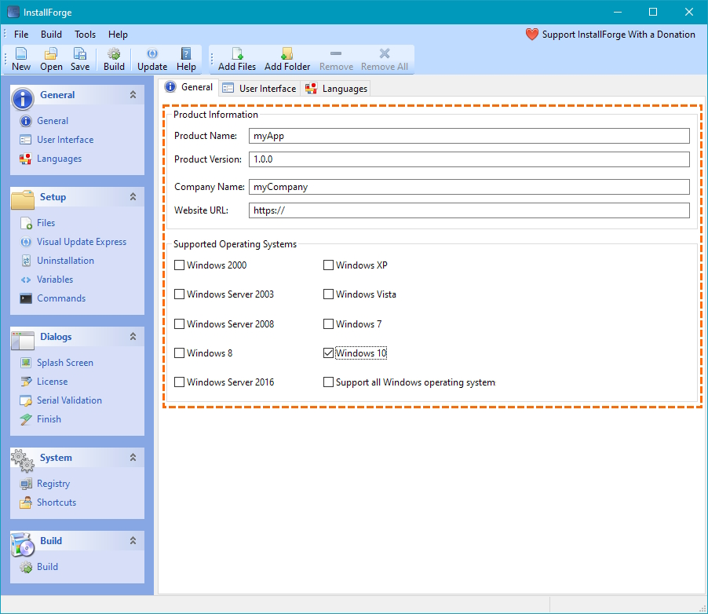
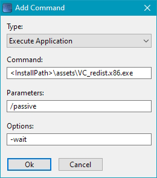

# Quick Start Guide

## Overview

This section is intended for those users who are using InstallForge for the first time and want to familiarize
themselves with the basic functions within a brief period of time. It is assumed here that InstallForge has already been
successfully [installed](installation.md) on the build system.

In the subsequent sections, you will become familiar with these subjects:

- Basic handling of the IBE
- Building a setup package with basic capabilities for a fictitious software application

## Scenario

Within the scope of this page, the following fictitious scenario is assumed:

Your company _myCompany_ has developed a monolingual (English) client-desktop application, named _myApp_, specifically
for Windows 10, and now you want to bundle version `1.0.0` it into a self-contained, standalone setup package using
InstallForge. During runtime, your application depends on the Microsoft Visual C++ Redistributable. Your goal is to
distribute this setup package to your end-users, enabling them to conveniently install and use your application on
their system.

!!! note

    According to this scenario, the **target system**[^1] is Windows 10.

You have the following functional requirements for the setup package:

- The setup package checks if the operating system of the target system is Windows 10. If not, the installation will
  not be performed.
- The user interface of the setup package is in English.
- The program files of your application shall be installed in a path specified by the end-user. A default path
  shall be predefined.
- During installation, the end user shall be presented the license of your application. The user shall only be able to
  proceed with the installation if he accepts the license via the user interface.
- The Microsoft Visual C++ Redistributable package shall be installed automatically during the setup.
- The user shall be able to uninstall the installed application in a comfortable way.
- Shortcuts of the application executable shall be created on the desktop and the start menu of the specific user
  performing the installation. In addition, a shortcut shall be created in the start menu to easily uninstall the
  application.

## Overview of the Program Files for _myApp_

The assumption here is that _myApp_ has already been built (i.e., the executable has been compiled) and all the
required program files are located in an arbitrary folder on the *build system*[^2]. The content of this folder is
supposed to look like this:

```
+--- assets
|   +--- someAsset.dat
|   +--- VC_redist.x86.exe
+--- docs
|   +--- myAppDoc.html
+--- lib
|   +--- someLib.dat
+--- license.txt
+--- myApp.exe
```

As you can see, the executable `myApp.exe` of _myApp_ is located at the top level of the folder. The pre-built setup
package of the Microsoft Visual C++ Redistributable (obtained from the Microsoft website) is located in the `assets`
folder.

## Overview of the IBE Interface

Now that all functional requirements for the setup package to be created have been defined based on the fictional
scenario and all program files are prepared, the [IBE of InstallForge can be launched](installation.md#launch).

After launching the IBE, a GUI (graphical user interface) should appear, which can be simplistically divided into 4
main areas according to the table below. These areas are also depicted in the picture below.

| Area         | Description                                                                                                                                                                                         |
|--------------|-----------------------------------------------------------------------------------------------------------------------------------------------------------------------------------------------------|
| Menu Bar[^3] | Provides access to fundamental functionalities, such as creating a new InstallForge project file, opening/saving an InstallForge project file and building a setup package.                         |
| Toolbar[^4]  | Provides access to some fundamental functionalities from the menu bar and also enables the user to add/remove files/folders to the setup package.                                                   |
| Left Pane    | Lists functional categories, which in turn are divided into sections that allow related configurations of the setup package to be created.                                                          |
| Main Pane    | The Main Pane is where the configurations of the setup package to be created are carried out. The configuration options displayed in the Main Pane depend on the selected section in the Left Pane. |

<figure markdown>
  
  <figcaption>Overview of the InstallForge Builder Environment GUI</figcaption>
</figure>

## Configuration of the Setup Package

In this section, the configuration of the setup package is demonstrated on the basis of the functional requirements
defined above.

### General Information

In the first step we will configure the general information for our setup package. Follow the steps below for this
purpose:

1. Click `General` in the `General` category listed in the left pane.
2. In the main pane, enter the following information:
    - `myApp` in the `Product Name` input field.
    - `1.0.0` in the `Product Version` input field.
    - `myCompany` in the `Company Name` input field.
2. In the `Supported Operating Systems` group, make sure that only `Windows 10` is checked.

This is how the result should look like in the IBE GUI:

<figure markdown>
  
  <figcaption>General Section</figcaption>
</figure>

### Language

As according to our requirements the setup package should be built in English only, no further configuration is required
at this point since InstallForge builds setup packages in English by default.

### Program Files

In the next step we will add our program files to the setup package:

1. Open the `Files` section in the category `Setup` from the left pane.
2. Simply drag and drop the program files and folders of _myApp_ on the file/folder list, as depicted in the
   animation below. InstallForge will recursively add all folders and their sub-folders to the setup package.

!!! note

    Instead of using the drag & drop functionality, you may also add the program files/folders through the 
    main toolbar.

<figure markdown>
  
  <figcaption>Adding Program Files/Folders to the Setup Package</figcaption>
</figure>

Now that we have added our program files/folders, we will configure the installation path on the **target system**:

1. In the `Default Installation Path` group, provide this installation path:

    ```
    <ProgramFiles>\<Company>\<AppName>\
    ```

2. Make sure that `Allow user to change installation path` is checked.

!!! note

    The provided (default) installation path `<ProgramFiles>\<Company>\<AppName>\` will be resolved dynamically 
    during the runtime of the setup package. `<ProgramFiles>` is a **path constant** which usually will be resolved to 
    `C:\Program Files (x86)` on a 64-bit Windows target system. `<Company>` and `<AppName>` are **setup constants** 
    and will be resolved to `myCompany` and `myApp` in this particular case. For a full list of supported **path** 
    and **setup constants**, refer to [this page](../how-tos/using-predefined-constants.md).

### Uninstaller

In order to allow your end-users to conveniently uninstall your application, follow these steps:

1. Open the `Uninstallation` section in the category `Setup` from the left pane.
2. Make sure that `Include Uninstaller` is checked.
3. Make sure that the name of the uninstaller executable file is `Uninstall` (this name should be configured by
   default).

!!! note

    With this configuration, InstallForge will add another artifact to the setup package during build,
    namely an executable file representing the uninstaller. This executable file will be installed in the 
    installation path together with the program files of your application.

!!! tip

    If the final size of the setup package is of particular importance to you: the uninstaller executable file has 
    just a size of approx. 840 KB!

### Launching the Microsoft Visual C++ Redistributable Setup Automatically

According to the functional requirements, our application *myApp* needs the Microsoft Visual C++ Redistributable
package during runtime. Obviously, one possibility would be to leave it up to the end-user to install the package
himself. However, it is preferable to relieve the end-user from this additional effort and let our setup package
install it automatically.

In the section [Program Files](#program-files), we already added the setup file of the Microsoft Visual C++
Redistributable package to our setup creator. When the end-user runs our setup package, this setup file will be 
extracted to the specified installation path. 

In the next step, we now need to configure our setup package to run this
setup during the installation of our application. To do this, we make use of the *Commands* functionality of 
InstallForge as follows:

1. Open the `Commands` section in the category `Setup` from the left pane.
2. Click the `Add...` button on the main pane. As a result, a dialog windows titles `Add Command` will appear.
3. On the dialog window, provide these information (see also the picture below):

    - In the `Command:` input field, enter:

        ```
        <InstallPath>\assets\VC_redist.x86.exe
        ```

    - In the `Parameters:` input field, enter:

        ```
        /passive
        ```
   
    - In the `Options:` input field, enter:

        ```
        -wait
        ```

<figure markdown>
  
  <figcaption>Add Command Dialog Window</figcaption>
</figure>

!!! note

    - `<InstallPath>` is a **path constant** that will be resolved during the runtime of our setup package to the 
      installation path specified by the end-user (e.g. `C:\Program Files (x86)\myCompany\myApp`).
    - The setup file `VC_redist.x86.exe` will be launched *after* all of our program files have been extracted. It 
      will be launched with the command-line parameter/argument `/passive`, which is specific to [MSI](https://en.wikipedia.org/wiki/Windows_Installer), a technology used by Microsoft to create setup files for their 
      redistributable packages. This parameter will ensure that the redistributable package setup  is executed 
      immediately without any user interaction with the GUI.
    - The option `-wait` is specific to InstallForge setup packages and will make our setup to wait until the 
      execution of the redistributable package setup is finished.

After the Microsoft Visual C++ Redistributable package is installed, the setup file located in the installation path 
should be deleted so as not to occupy unnecessary hard disk space on the end-user's system. For this purpose we will
create another command as follows:

1. Click again the `Add...` button on the main pane.
2. On the opened dialog window, provide these information:

    - Select `Shell Execute` as the command type.

    - In the `Command:` input field, enter:

        ```shell
        del "<InstallPath>\assets\VC_redist.x86.exe"
        ```

!!! note

      The two commands we have specified so far will be executed in the order they were created.

### Providing a License Text

To display your individual license text to the end-users during the installation of your application, asking them to 
agree to the license terms, follow the steps below:

1. Click `License` in the `Dialogs` category listed in the left pane.
2. On the main pane, make sure that `Show License Agreement Dialog` is checked.
3. In the editor field, enter your individual license text. Additionally, format the text using the local toolbar 
   buttons on the main pane.

### Launching the Application after Finishing Installation

To allow the end-users to launch your application (`myApp.exe`) directly from the setup wizard once the installation 
is finished, follow these steps:

1. Click `Finish` in the `Dialogs` category listed in the left pane.
2. On the main pane, make sure that `Run Application` is checked.
3. In the input field next to the `Run Application` checkbox, enter the following path:
```
<InstallPath>\myApp.exe
```
4. Additionally, specify the command-line parameters which `myApp.exe` shall be executed with in the `Argument` 
   input field.

### Configuring Shortcuts

According to the functional requirements of our setup package, we want shortcuts to be created during installation.
To do this, follow these steps

1. Click `Shortcuts` in the `System` category listed in the left pane.
2. On the main pane, make sure that `Create start menu shortcuts for all users` and `Create desktop shortcuts for all 
   users` is unchecked.
3. Click the `Add...` button on the main pane and provide the following information in the `Add Shortcut` dialog window:
    
    - Specify `Desktop` as the destination.
    - In the `Shortcut Name` input field, enter:

        ```
        myApp
        ```

    - In the `Target File` input field, enter

        ```
        <InstallPath>\myApp.exe
        ```
      
    - Click the `Ok` button.

4. Repeat the previous step, but select `Startmenu` as the destination.
5. Repeat step 3 again, but provide these information:

    - Specify `Startmenu` as the destination.
    - In the `Shortcut Name` input field, enter:

        ```
        Uninstall myApp
        ```

    - In the `Target File` input field, enter

        ```
        <InstallPath>\Uninstall.exe
        ```

### Building the Setup Package

Now that we have fully configured our setup package, we are going to build it in the final step:

1. Click `Build` in the `Build` category listed in the left pane.
2. On the main pane, provide a valid path for the setup file.
3. In the main menu, click `Build` → `Build Setup`. Alternatively, press ++f5++.

!!! success

      Provided your configuration does not contain any errors, the setup package should now be built successfully.

[^1]: System which is targeted by the setup packages built using the IBE.
[^2]: System on which the IBE is operated on in order to build setup packages.
[^3]: Also referred to as main menu.
[^4]: Also referred to as main toolbar.
