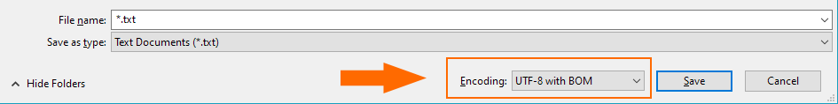

# Creating Your Own Language File

You are able to easily extend InstallForge by creating your own language files which you can use to target more
languages for your setup packages. Language files have the `ifl` extension and are located inside the `lang` folder in
the
InstallForge installation directory (see also [Installing New Language Files](installing-new-language-files.md)). Basically, `.ifl`-files are simple text
files in the [INI] format. Thus, they can be created with any text editor such as Microsoft Notepad.

!!! info

    InstallForge is fully Unicode compatible.

!!! danger "Important"

    You have to use the UTF-8 encoding with [BOM] for your language files.
    This can be easily achieved in Microsoft Notepad (see image below).

<figure markdown>
  
  <figcaption>Microsoft Notepad Encoding</figcaption>
</figure>

In order to create your own language file, the best way to start is altering our language file for English:

``` ini title="English.ifl" linenums="1"
// Copyright (C) 2006 solicus
// English language file for InstallForge.
// Last updated: 2020-04-24

[Main]
Title= <appname> Setup

[Gadgets]
NextBtn = Next >
CancelBtn = Cancel
BackBtn = < Back
FinishBtn = Finish
BrowseBtn = Browse…
AcceptOptn = I accept the agreement
DoNotAcceptOptn = I do not accept the agreement
CreateDesktopIconCbx = Create desktop icon
CreateStartMenuFolderCbx = Create start menu folder
LaunchProgramCbx = Launch
RebootCbx = Reboot computer now
DestinationFolderFR3 = Destination Folder
SelAppFolder=Select Application Folder:
SelStartMenuFolder=Select Start Menu Folder:

[Messages]
ExitSetupH = Exit Setup
ExitSetup = Do you want to abort the installation?
CouldNotExtractFileH = Error
CouldNotExtractFile = Could not extract file!

[Start]
Title = Welcome to the <appname> Setup Wizard
Text = This will install <appname> <appversion> on your computer. It is recommended that you close all other applications before continuing. Click Next to continue.

[LicenceAgreement]
HeadT = License Agreement
HeadB = Read the following important information before continuing.
Text1 = Please read the following License Agreement. you must accept the terms of this agreement before continuing with the installation.

[ApplicationFolder]
HeadT = Select Application Folder
HeadB = Please choose the directory for the installation.
Text1 = Setup will install <appname> in the folder shown below.
Text2 = To continue, click Next. If you would like to select a different folder, click Browse.
Text3 = Required free space:
Text4 = Available free space:

[StartMenuFolder]
HeadT = Select Start Menu Folder
HeadB = Where should Setup place the program’s shortcuts?
Text1 = Setup will create the program’s shortcuts in the following Start Menu Folder.
Text2 = To continue, click Next. If you would like to select a different folder, click Browse.

[AdditionalTasks]
HeadT = Select Additional Tasks
HeadB = Which additional tasks should be performed?
Text1 = Select the additional tasks you would like setup to perform while installing <appname>, then click Next.
Text2 = Additional icons:

[Installing]
HeadT = Installing
HeadB = Please wait while Setup installs <appname> on your computer.
Text1 = Preparing to install..
Text2 = Installing..
Text3 = Configuring..

[Finish]
Title = Completing the <appname> Setup Wizard
Text1 = Setup has finished installing <appname> on your computer. Click Finish to exit Setup.

[SerialCheck]
HeadT = User Information
HeadB = Please enter your information.
Text1 = User Name:
Text2 = Organization:
Text3 = Serial Number:

[Uninstall]
Header = Uninstall Status
Header_b = Please wait while <appname> is removed from your computer.
Uninstalling = Uninstalling
Btn_cancel = Cancel
ExitUninstall_T = Uninstall
ExitUninstall = Do you want to exit uninstall?
Success_T = Uninstall
Success = <appname> was successfully removed from your computer!
BM_T = Uninstall
BM = Do you want to remove <appname> from your computer?
```

[BOM]: https://en.wikipedia.org/wiki/Byte_order_mark
[INI]: https://en.wikipedia.org/wiki/INI_file
