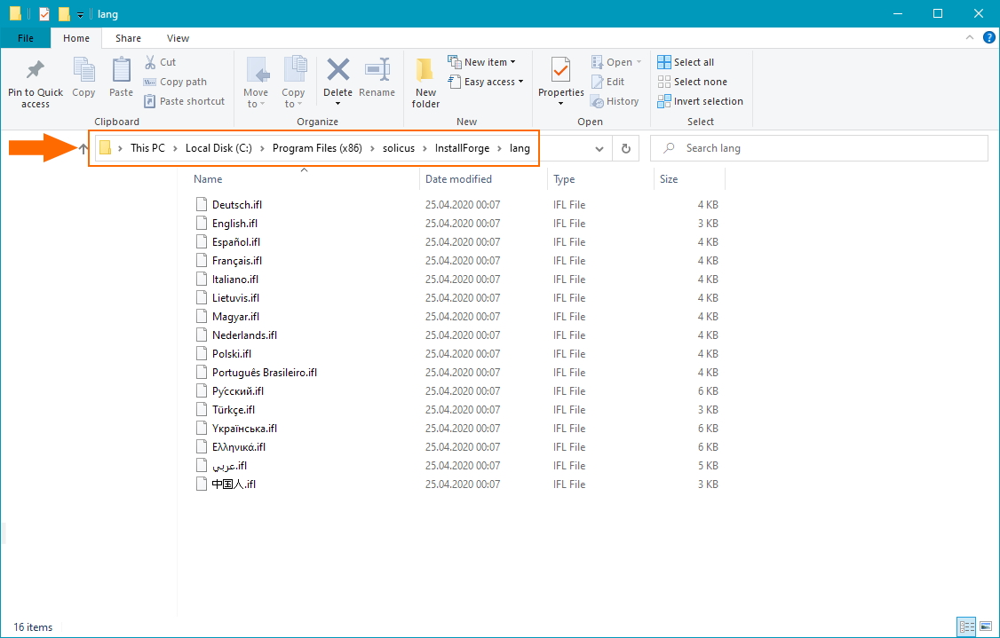

# Installing New Language Files

InstallForge is capable of creating multilingual setup packages. The supported target languages are present in so-called
language files with the `ifl` extension, which are located in the `lang` folder inside the InstallForge installation
directory (typically `C:\Program Files (x86)\solicus\InstallForge\lang\`) as depicted below. In order to install a new
language file and make it available as a target language for your setup packages, just place the file inside the lang
folder.

!!! info

    You may need elevated rights in order to install new languages files, depending on the location of the InstallForge installation directory.

<figure markdown>
  
  <figcaption>InstallForge Installation lang Folder</figcaption>
</figure>
