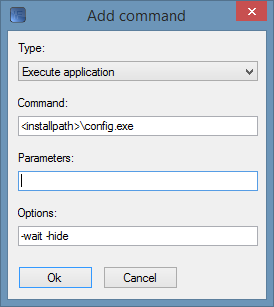
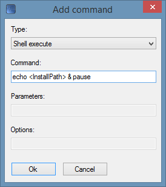
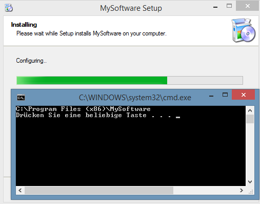

# Using Custom Commands

## Introduction

InstallForge is capable of executing custom commands during the installation progress making your setups more powerful.
You can either run applications or tasks in the Windows command-line interpreter.

## Run a Custom Application

In order to add a new command click on `Add` in the `Commands` section. After choosing a command type (`Execute
application` or `Shell execute`) you can enter the necessary parameters. In the example below we make our setup run
config.exe once all files have been extracted. By using the `-wait` option we ensure that the setup will wait until
config.exe is finished. The option `-hide` can be used to start the program in a hidden mode.

<figure markdown>
  
  <figcaption>Add command Dialog Window</figcaption>
</figure>

## Run a Custom Task in the Windows CLI
You can also run a task in the Windows CLI like in this example:

<figure markdown>
  
  <figcaption>Add command Dialog Window</figcaption>
</figure>

This will generate the following behaviour during the installation:

<figure markdown>
  
  <figcaption>Executing Shell Commands</figcaption>
</figure>
