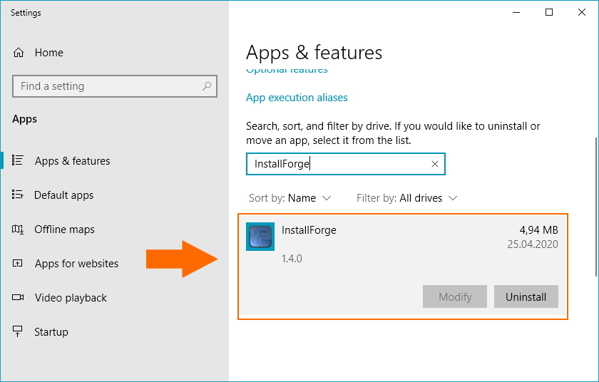

# Using a Custom Display Icon in Windows Apps and Features

InstallForge enables you to change the icon of your installation displayed in the **Apps & Features** section in
Windows, as indicated in the image below.

<figure markdown>
  
  <figcaption>Apps and Features Panel in Windows</figcaption>
</figure>

In order to specify a custom icon, please complete the same steps as in
the [Using a Custom Display Icon in Windows](using-custom-display-icon-in-windows-programs-and-features.md)
Programs and Features article.
