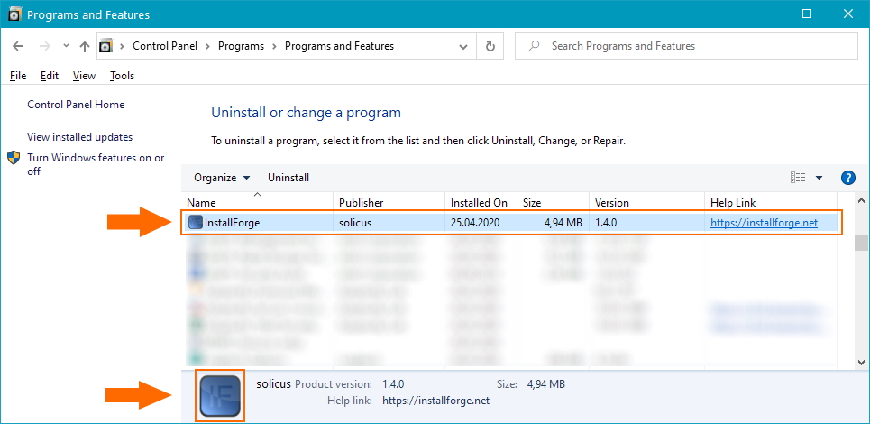
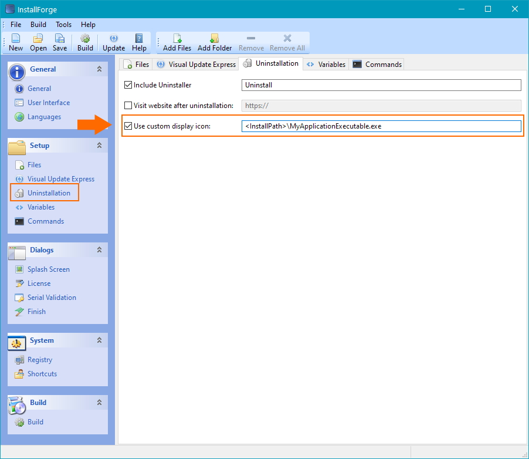

# Using a Custom Display Icon in Windows Programs and Features

InstallForge enables you to change the icon of your installation displayed in the **Programs & Features** section in
Windows, as indicated in the image below.

<figure markdown>
  
  <figcaption>Programs and Features Panel in Windows</figcaption>
</figure>

In order to specify a custom icon, please complete the following steps (also, see the image below):

1. In the InstallForge Builder Environment, click `Uninstallation` in the explorer bar.
1. Activate the `Include Uninstaller` checkbox located on the `Uninstallation` tab widget.
1. Activate the `Use custom display icon` checkbox and specify a path to an executable, [DLL](https://en.wikipedia.org/wiki/Dynamic-link_library) or icon file (`.ico`).

The icon displayed in the Programs & Features section will be extracted from the specified file.

!!! info

    If the `Use custom display icon` checkbox is not activated, InstallForge will use the icon of the uninstaller executable.

<figure markdown>
  
  <figcaption>Uninstallation Section in the InstallForge Builder Environment</figcaption>
</figure>
