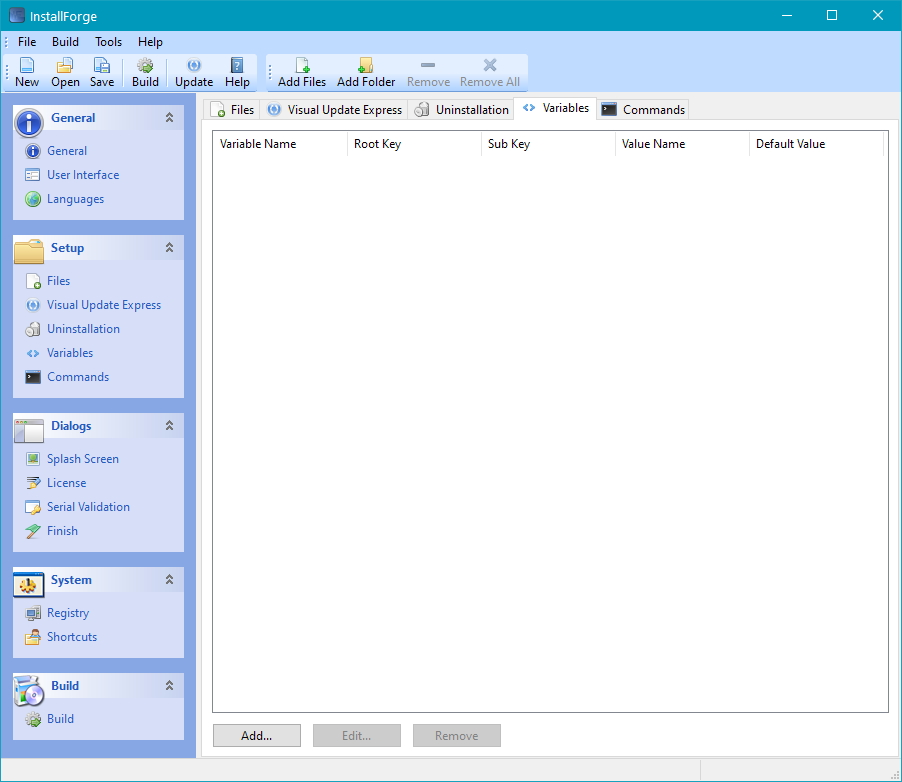
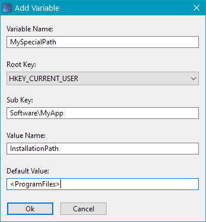
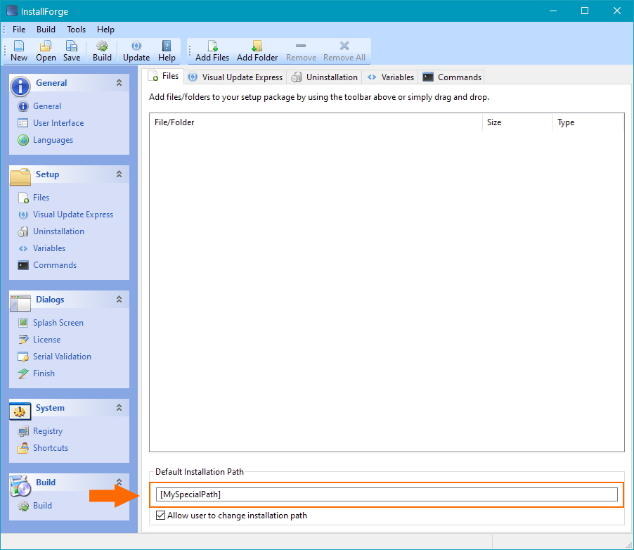

# Using Custom Variables

## Introduction

Since version 1.2.3 InstallForge allows you to define custom variables that can be used for other parameters your setup
needs. InstallForge will use the Windows registry in order to set the values of your variables.

!!! danger "Important"

    As of InstallForge 1.4.0, you need to enclose the name of your custom variables with brackets [ ] when using them.

## Create a New Variable

To create a new custom variable, complete the following steps:

1. In the InstallForge Builder Environment, click `Variables` in the explorer bar.
1. On the `Variables` tab widget, click `Add...`

<figure markdown>
  
  <figcaption>InstallForge Custom Variables Section</figcaption>
</figure>

## Specify Variable Details

In the next step you have to define the name of your variable, parameters for the Windows registry and a default value
on the `Add Variable` window. If the setup is not able to find the value name you specified for the registry, it will
use
the default value. Finally click on `Ok` in order to create your variable.

!!! tip

    It is always a good practice to define a default value.

<figure markdown>
  
  <figcaption>Add Variable Dialog Window</figcaption>
</figure>

## Example of Usage

Now you are ready to use your variable (e.g. for the default installation path of your setup as indicated in the picture
below).

<figure markdown>
  
  <figcaption>InstallForge Files Section</figcaption>
</figure>
