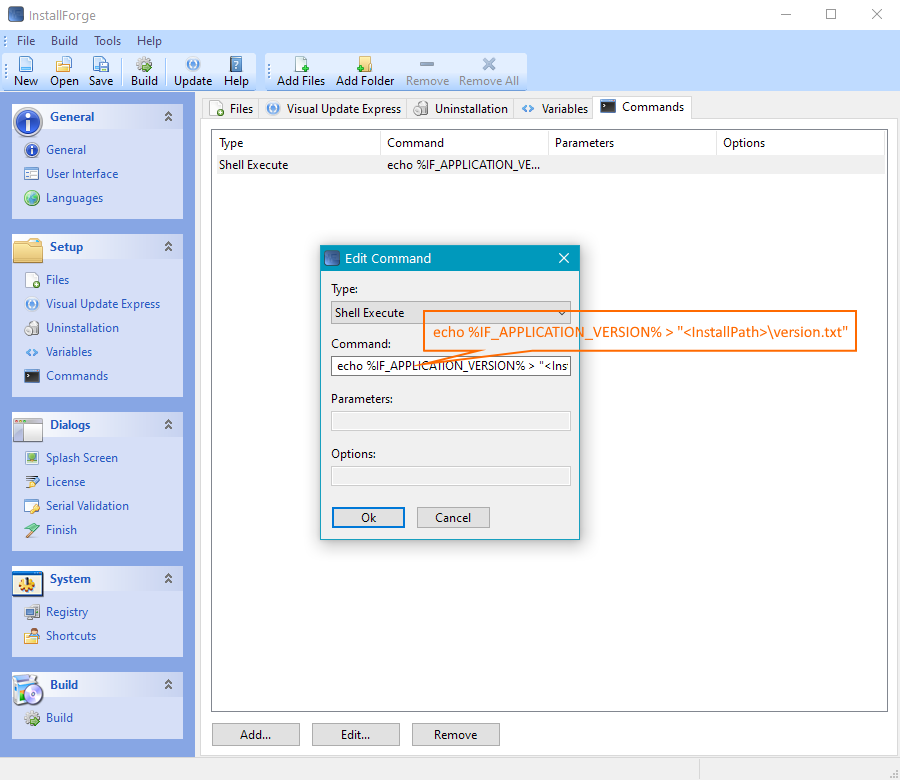

# Using Environment Variables

## Introduction
Setup packages created with InstallForge initialize a set
of [environment variables](https://en.wikipedia.org/wiki/Environment_variable) during runtime. These
variables can be used for [Custom Commands] in order to perform more complex tasks during the
installation of your application.

## Environment Variables
The following table lists the supported environment variables.

{{ read_csv('../../data/EnvironmentVariables.csv') }}

## Example

In this example, a text file containing the application version as a string will be created during the installation by using the [Custom Commands] feature and the `IF_APPLICATION_VERSION` environment variable.

Please complete the following steps:

1. In the InstallForge Builder Environment, click `General` in the explorer bar and enter a version in the `Product 
Version` field.
1. Click `Commands` in the explorer bar, click `Add...` on the `Commands` tab widget.
1. On the `Edit Command window`, select `Shell Execute` as command type.
1. In the `Command` field, enter:
```
echo %IF_APPLICATION_VERSION% > “<InstallPath>\version.txt”
```
1. Click `Ok` on the `Edit Command` window.

<figure markdown>
  
  <figcaption>InstallForge Commands Section</figcaption>
</figure>


[Custom Commands]: using-custom-commands.md
